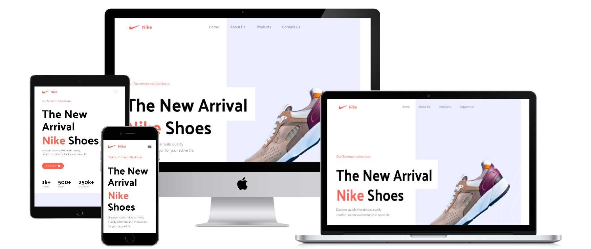

# Nike 2.0 - landingpage

**Live Preview: [Here](https://nike-2-landingpage.vercel.app)**

Fully responsive and modern looking landingpage.

---

**React with Vite Project** made as a practice project. There is only first page in the website. In this project I learned how to create modern UI, understand how is Tailwind working and Tailwind best practices. By this project I betterment also my JS and React skills.   The page is divided into sections:
- Hero,
- Popular products,
- Super quality,
- Services,
- Special offer,
- Customer reviews,
- Subscribe,

## In project are used: 
- Reuseable components,
- Mapping ready for imports from database
- Responsive Web Design (RWD)

## Tools Used
1. JavaScript (React)
2. Vite
3. Tailwind (Styles)
4. Vercel (Deployment)
5. VSCode (Code Editor)

Deploy on Vercel free,  
[Link to tutorial by JSMastery](https://www.youtube.com/watch?v=tS7upsfuxmo)
